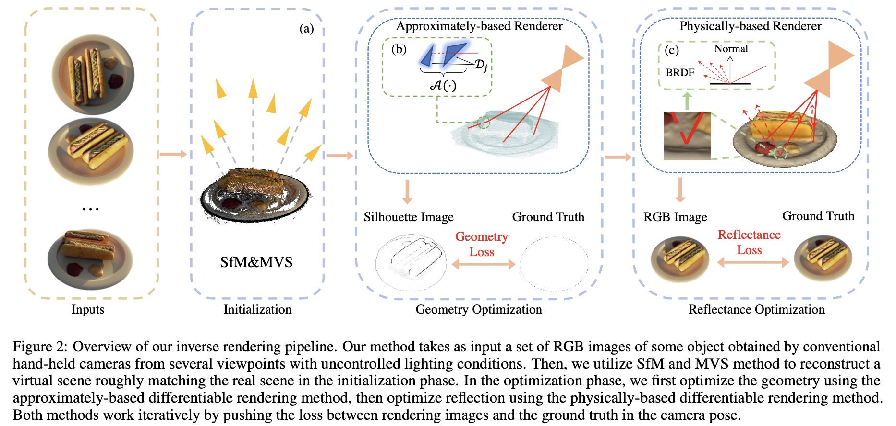

## Efficient Multi-View Inverse Rendering Using a Hybrid Differentiable Rendering Method

Xiangyang Zhu, Yiling Pan, Bailin Deng and Bin Wang^{*}

## Efficiency

## Overview


### Installation
Clone this repo
```
git clone https://github.com/liuguandu/RC-LUT
```
Install requirements: torch>=1.5.0, opencv-python, scipy, mitsuba2
